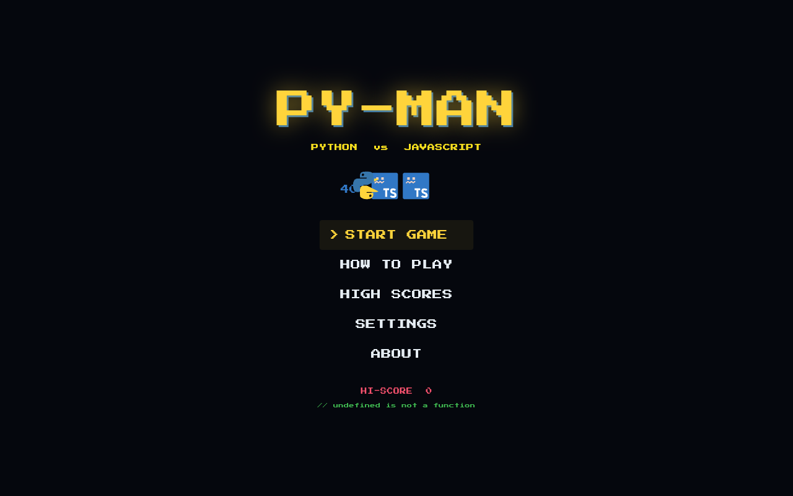
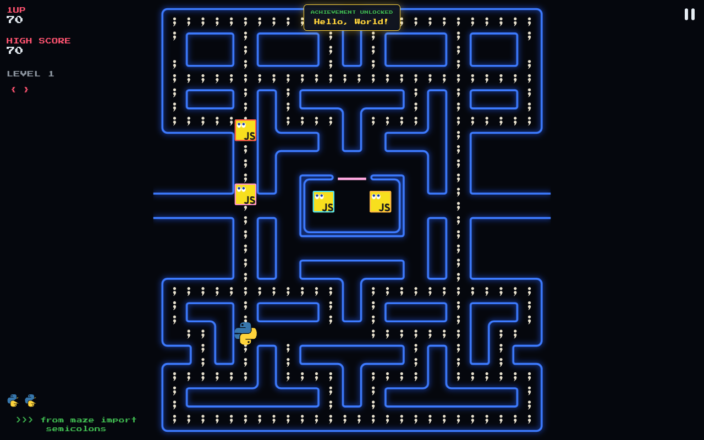
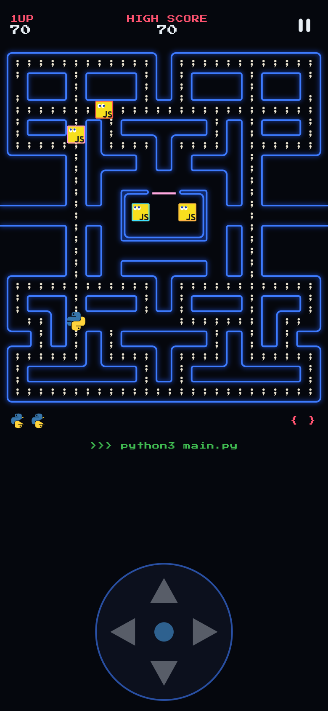
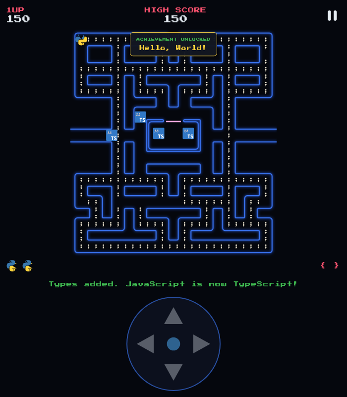
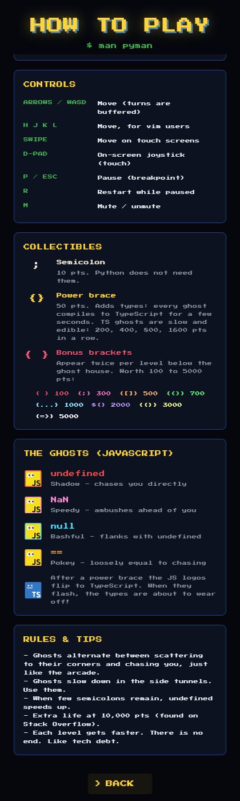

# PY-MAN: Python vs JavaScript

> `// undefined is not a function`

**PY-MAN** is an open-source arcade maze game for developers, built with Flutter.
It plays like the 1980 arcade classic, with programming languages as the cast:

- 🐍 **You are Python**, drawn as the Python logo with a chomping mouth.
  Python never needed semicolons, so you eat all of them.
- 👻 **The ghosts are JavaScript logos**: `undefined`, `NaN`, `null` and `==`,
  each framed in its classic arcade colour.
- `{ }` **Power braces add types.** Eat one and every JS logo flips into the
  **TypeScript** logo for a few seconds. TypeScript ghosts are slow and edible,
  and they flash just before flipping back to JavaScript.

The ghost AI follows the original arcade rules (scatter/chase waves, per-ghost
targeting, frightened wandering, tunnel slowdown, Cruise Elroy, ghost-house dot
counters), so it plays like a real arcade game rather than a mobile reskin.

---

## Screenshots

| Main menu | Desktop | Phone |
| --- | --- | --- |
|  |  |  |

| TypeScript mode (after a power brace) | How to play |
| --- | --- |
|  |  |

**Gameplay GIF:** _placeholder. Record one with your favourite screen recorder
and save it as `docs/screenshots/gameplay.gif`._

<!--  -->

---

## Features

**Arcade gameplay**
- The classic 28×31 maze with 240 semicolons `;` and 4 power braces `{}`.
- Four JavaScript ghosts, each with its own arcade targeting personality.
- Scatter/chase waves, TypeScript (frightened) mode with flashing warning,
  eaten ghosts returning to the house as eyes, and a 200 → 400 → 800 → 1600
  combo for eating ghosts in a row.
- Bonus brackets twice per level (`{ }`, `{;}`, `{[]}`, `{()}`, `{...}`,
  `${}`, `{{}}`, `{=>}`), worth 100 to 5000 points.
- Level speeds, TypeScript durations and Cruise Elroy thresholds taken from the
  arcade tables. Extra life at 10,000 points.
- Deterministic fixed-timestep simulation (120 Hz) that plays the same on 60,
  120 or 144 Hz displays.

**Developer theme**
- A one-line "console" under the maze reacts to the game
  (`$ tsc --init  # JS -> TS`, `TypeError: Cannot read properties of undefined`,
  `Caught: == -> ===`, `[OK] Deployed on a Friday.`).
- 10 achievements, including *Hello, World!*, *"strict": true*,
  *Stack Overflow*, *Garbage Collector* and *Rubber Duck*.
- Easter eggs: vim keys (`hjkl`), and the Konami code on the main menu.
- Pause is a "BREAKPOINT"; game over is `Process finished with exit code 1`.

**Logo character skins**
- Python is the Python logo. The classic chomping mouth is cut out of the
  logo in the direction of travel, and it collapses in the arcade death
  animation.
- Ghosts are JavaScript logos with arcade eyes that look where they're going,
  a two-frame hover animation, and a thin frame in each ghost's classic
  colour (red, pink, cyan, orange).
- A power brace plays a card-flip transition that turns every JS logo into
  the TypeScript logo. The logos flash white near the end, then flip back to
  JavaScript. Eaten ghosts return home as eyes.
- All logos are vector paths (no image assets or fonts), so they stay sharp
  on every platform and screen size. Sprite sizes are fixed, so collision
  boundaries don't depend on logo shape.

**UI, audio and polish**
- Minimal arcade UI: neon maze, attract-mode animation on the menu, pixel font.
- Responsive layouts for phone portrait/landscape, tablets, desktop and
  ultrawide.
- Keyboard, swipe and on-screen D-pad controls.
- Arcade sound effects, a ghost siren, TypeScript-mode warble, and menu music,
  all generated from code (see [Credits](#credits--attributions)).
- Local high-score table (top 10 with initials), persistent settings and
  achievements.
- Accessibility options: reduce flashing, mute, adjustable volume, optional
  CRT scanlines.
- Auto-pause when the app loses focus or goes to the background.

---

## Tech stack

| Area | Choice |
| --- | --- |
| Framework | Flutter 3.47 (stable), Dart 3.13 |
| Rendering | `CustomPainter` with cached rasterised walls and pictures |
| Audio | [`audioplayers`](https://pub.dev/packages/audioplayers) |
| Persistence | [`shared_preferences`](https://pub.dev/packages/shared_preferences) |
| State | Plain Dart game engine plus `ChangeNotifier`/`ValueNotifier`. No state-management package. |
| Tests | `flutter_test` (unit, simulation and widget tests) |

There are only two runtime dependencies.

---

## Requirements

- Flutter **3.47+** (stable channel), which bundles Dart 3.13+
- Per target platform:
  - **Android:** Android SDK / Android Studio
  - **iOS / macOS:** Xcode on macOS (plus CocoaPods)
  - **Web:** Chrome or any modern browser
  - **Windows:** Visual Studio with the "Desktop development with C++" workload
  - **Linux:** `clang`, `cmake`, `ninja`, `pkg-config`, GTK 3 dev headers, and
    GStreamer (`libgstreamer1.0-dev libgstreamer-plugins-base1.0-dev`) for audio

Run `flutter doctor` to check your setup.

---

## Installation / setup

```bash
git clone https://github.com/AshkanWatson/Pacman.git
cd Pacman
flutter pub get
```

## How to run

```bash
flutter run                 # pick a connected device
flutter run -d chrome       # web
flutter run -d macos        # or: windows, linux
```

## How to build

```bash
# Android
flutter build apk --release          # APK
flutter build appbundle --release    # Play Store bundle

# iOS (on macOS)
flutter build ipa --release

# Web (output in build/web)
flutter build web --release
# Fully self-hosted build that doesn't load CanvasKit from a CDN:
flutter build web --release --no-web-resources-cdn

# Desktop
flutter build macos --release
flutter build windows --release
flutter build linux --release
```

---

## Controls

| Action | Keyboard | Touch | Mouse |
| --- | --- | --- | --- |
| Move | Arrow keys / WASD / `hjkl` | Swipe anywhere, or the D-pad | n/a |
| Pause / resume | `P` or `Esc` | ⏸ button | ⏸ button |
| Restart (while paused) | `R` | RESTART | RESTART |
| Mute / unmute | `M` | Settings | Settings |
| Menus | Arrows + `Enter`/`Space`, `Esc` = back | Tap | Click |

Turns are **buffered**: press a direction early and Python takes the next
opening. Swipes also re-anchor while your finger is down, so one continuous
drag can steer through several corners. The D-pad shows automatically on
Android and iOS; you can change this under *Settings → Touch controls*.

---

## Game rules

- **Semicolons `;`** are worth 10 points. Eat every semicolon and power brace
  to clear the level.
- **Power braces `{}`** are worth 50 points and turn every ghost into
  **TypeScript** for a few seconds (less on later levels). Eat TypeScript ghosts
  for 200 / 400 / 800 / 1600 points. When they flash, the types are wearing off.
- **Bonus brackets** appear below the ghost house after 70 and 170 collectibles
  and stay for about 9 to 10 seconds.
- Touching a **JavaScript ghost** costs a life. You start with 3 lives (5 is
  available in Settings) and earn one extra life at 10,000 points.
- **The ghosts:**
  | Ghost | Arcade role | Behaviour |
  | --- | --- | --- |
  | `undefined` (red) | Blinky | Targets Python's tile directly. Speeds up ("Cruise Elroy") when few semicolons remain. |
  | `NaN` (pink) | Pinky | Ambushes 4 tiles ahead of Python, including the arcade's "facing up" overflow bug. |
  | `null` (cyan) | Inky | Flanks: doubles the vector from `undefined` to 2 tiles ahead of Python. |
  | `==` (orange) | Clyde | Chases from far away, retreats to his corner within 8 tiles. |
- Ghosts alternate **scatter** and **chase** waves, reverse direction when the
  mode changes, can't turn upward in four specific tiles, and slow down in the
  side tunnels. All of this matches the arcade.
- Each level is faster than the last. There's no final level, just like tech debt.

---

## Project structure

```
lib/
├── main.dart                 # Bootstraps storage, audio and the app
├── app.dart                  # MaterialApp, theme, global shortcuts
├── app_scope.dart            # InheritedWidget exposing app services
├── game/                     # Pure Dart gameplay. No Flutter imports.
│   ├── game_engine.dart      # Fixed-timestep simulation, phases, scoring, collisions
│   ├── game_events.dart      # Events emitted to the UI (sounds, messages, achievements)
│   ├── achievements.dart     # Achievement definitions and tracker
│   ├── dev_messages.dart     # Developer jokes for the console line
│   ├── ai/ghost_ai.dart      # Arcade targeting and steering
│   ├── core/                 # Maze, tiles, directions, per-level tables
│   └── entities/             # Python (player) and JS ghosts
├── services/                 # Audio, high scores, settings, key/value storage
└── ui/
    ├── theme.dart            # Palette and text styles
    ├── render/               # Board renderer (cached walls/pellets) and vector sprites
    ├── screens/              # Menu, game, how to play, high scores, settings, about
    └── widgets/              # Arcade buttons, HUD, overlays, touch controls
assets/
├── audio/                    # Generated .wav sound effects and music
└── fonts/                    # Press Start 2P (OFL)
tool/
├── generate_audio.dart       # Synthesises every sound: dart run tool/generate_audio.dart
└── app_icon.svg              # Source of the app icon
test/
├── game/                     # Maze, AI, engine, simulation/bot, achievements
├── services/                 # High scores, settings, audio stubs
└── ui/                       # Menu navigation, game screen, controls, layouts
```

The gameplay logic (`lib/game`) is pure Dart with no Flutter dependency. The
UI drives it with a `Ticker`, reads its state to paint, and drains its events
to play sounds and show messages.

---

## Testing

```bash
flutter analyze
flutter test
```

The test suite covers:
- **Maze:** dimensions, collectible counts, reachability, tunnel wrap, door rules.
- **Ghost AI:** each ghost's chase target (including the Pinky/Inky "up" bug),
  tie-break order, no-reverse rule, restricted zones, frightened wandering.
- **Engine:** movement, buffered turns, reversal, walls, tunnel, scoring,
  power-up and ghost combo, bonus items, extra life, collisions (including
  head-on pass-through), lives, game over, level completion, scatter/chase
  timing, ghost-house release, Cruise Elroy, pause.
- **Simulation:** a BFS bot clears three levels through real movement, and
  random-play stress runs check invariants such as never being inside a wall.
- **UI:** menu navigation (mouse and keyboard), Konami code, settings, game
  screen at 7 screen sizes, keyboard/WASD/vim/swipe controls, pause/resume/
  restart, game over with initials entry, and sound triggers.

---

## Contributing

Contributions are welcome, whether that's bug fixes, new jokes, achievements or
accessibility improvements.

1. Fork the repository and create a branch: `git checkout -b feature/my-idea`.
2. Keep gameplay logic in `lib/game` (pure Dart) and UI in `lib/ui`.
3. Add or update tests for any gameplay change.
4. Run `dart format .`, `flutter analyze` and `flutter test`. All three must
   be clean.
5. Open a pull request describing the change. Include screenshots for visual
   changes.

If you change sounds, edit `tool/generate_audio.dart` and regenerate the files
with `dart run tool/generate_audio.dart` instead of committing hand-made audio.
Please keep the game faithful to the arcade feel and keep the UI uncluttered.

---

## License

The source code is released under the [MIT License](LICENSE).
The bundled *Press Start 2P* font is licensed under the SIL Open Font License
1.1 ([assets/fonts/OFL.txt](assets/fonts/OFL.txt)).

---

## Credits / attributions

- **Font:** [Press Start 2P](https://fonts.google.com/specimen/Press+Start+2P)
  by CodeMan38, SIL Open Font License 1.1.
- **Audio:** every sound effect and music loop is synthesised from code by
  `tool/generate_audio.dart`. There are no third-party samples.
- **Graphics:** all sprites, the maze and the app icon are drawn in code or SVG
  in this repository. The character skins are vector redraws of the Python,
  JavaScript (community) and TypeScript logos (`lib/ui/render/logos.dart`).
- **Gameplay research:** *The Pac-Man Dossier* by Jamey Pittman, the reference
  for the ghost behaviour, speeds and timings.
- **Trademarks:** Pac-Man is a trademark of Bandai Namco Entertainment. Python
  is a trademark of the Python Software Foundation. JavaScript is a trademark
  of Oracle. TypeScript is a trademark of Microsoft. This is an unaffiliated,
  non-commercial fan tribute. The language logos are used as character skins
  for parody and remain the property of their owners. If you redistribute the
  game, check each owner's logo usage guidelines (for example the
  [PSF trademark policy](https://www.python.org/psf/trademarks/)).
